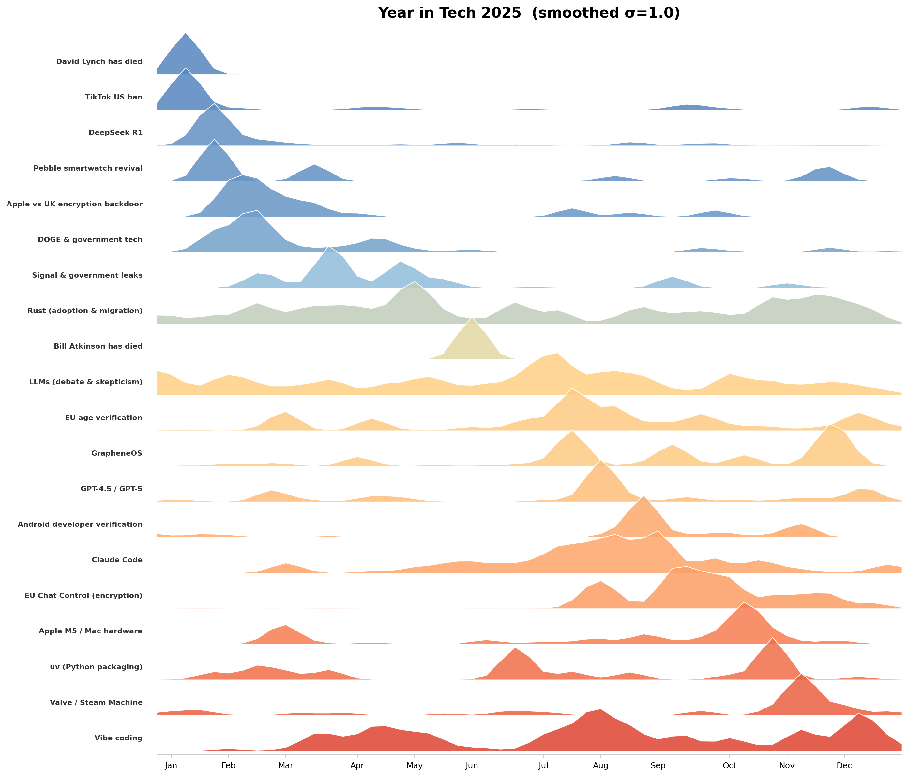

# Year in Tech

A pipeline that discovers what topics captured outsized attention on Hacker News in a given year and visualizes their attention curves as a ridge plot.

## How it works

The pipeline takes a year of Hacker News data and asks: *what were the big stories in tech this year?* It answers by treating HN's collective upvoting and commenting as an editorial signal — the community already surfaces what it finds noteworthy. Our job is to aggregate that signal into coherent topics, measure their intensity over time, and visualize the result.

### 1. Attention scoring

Each HN post gets a combined attention score:

```
attention = score + 0.5 × num_comments
```

This weights both upvotes and discussion. A post with 200 upvotes and 100 comments scores 250. The 0.5 weight is tunable in `src/config.py`.

### 2. Embedding and clustering

Post titles are encoded into 384-dimensional vectors using `all-MiniLM-L6-v2` (a sentence transformer). UMAP reduces these to 50 dimensions, then HDBSCAN groups semantically similar titles into topic clusters. This is unsupervised — no predefined categories, no keyword lists. The algorithm discovers topics from the data.

For 2024, this produces ~3,400 clusters from ~87,000 filtered posts. About 38% of posts end up as "noise" (not belonging to any cluster), which is normal for HDBSCAN and expected — many HN posts are one-off stories.

### 3. Time series and classification

For each cluster, we compute a 53-point weekly attention curve (ISO weeks 1–53) and derive metrics:

| Metric | What it measures |
|--------|-----------------|
| `total_attention` | Overall magnitude across the year |
| `peak_attention` | Height of the tallest week |
| `peak_week` | When the peak occurred |
| `duration_weeks` | Weeks with attention > 20% of peak |
| `spike_ratio` | Peak vs. mean attention (spikiness) |

Topics are classified based on these metrics:
- **Spike** — sharp, short-lived events (spike_ratio > 4, duration ≤ 3 weeks). Example: CrowdStrike outage, xz backdoor.
- **Sustained** — persistent year-round discussion (duration > 8 weeks). Example: Rust ecosystem, ChatGPT, LLMs.
- **Moderate** — everything in between. Example: TikTok ban, Boeing 737 MAX.

### 4. Labeling and curation

Each cluster is auto-labeled with the title of its highest-attention post, cleaned of HN prefixes ("Show HN:", "Ask HN:", etc.). The top 50 topics by total attention are exported as a draft CSV for human review.

Curation is intentionally manual: scan the list, merge topics that overlap, shorten labels, select 15–25 for the final visualization. An AI curation pass can suggest selections, but a human makes the final call.

### 5. Visualization

The final output is a ridge plot where each row is a topic's weekly attention curve, ordered chronologically by peak week. Topics are colored on a cool-to-warm gradient (January = blue, December = red). Gaussian smoothing (σ=1.0) removes weekly jitter while preserving spike character.

## 2025 results



The 2025 ridge plot captures 20 topics spanning the year:

- **David Lynch has died** — David Lynch, the visionary filmmaker behind Twin Peaks, Mulholland Drive, and Blue Velvet, died in January 2025.
- **TikTok US ban** — The US Supreme Court upheld the TikTok ban in January, the app briefly went dark, then was restored after Trump signaled a reprieve. Discussion continued throughout the year around child safety and national security.
- **DeepSeek R1** — Chinese lab DeepSeek released R1, an open-weight reasoning model that rivaled top Western models at a fraction of the cost. It dominated January headlines amid debates about censorship bypasses and a leaked database.
- **Pebble smartwatch revival** — Google open-sourced the Pebble OS and new PebbleOS watches were announced, reviving the beloved smartwatch brand years after its original shutdown.
- **Apple vs UK encryption backdoor** — The UK government secretly ordered Apple to create a global iCloud encryption backdoor. Apple pulled its data protection tool from the UK market rather than comply, and France publicly rejected a similar mandate.
- **DOGE & government tech** — Elon Musk's Department of Government Efficiency (DOGE) drew sustained attention as young, inexperienced engineers gained "god mode" access to government systems. Whistleblowers alleged sensitive data was taken from agencies like the NLRB.
- **Signal & government leaks** — A journalist was accidentally added to a Signal group chat with US national security leaders planning military operations. The incident triggered scrutiny of Signal's security model and the discovery that Trump officials were using a compromised Signal clone.
- **Rust (adoption & migration)** — Rust's role in systems programming was hotly debated all year. High-profile posts about migrating away from Rust sat alongside Greg Kroah-Hartman endorsing Rust in the Linux kernel, reflecting a community in active transition.
- **Bill Atkinson has died** — Bill Atkinson, creator of MacPaint, HyperCard, and key member of the original Macintosh team, died in June 2025.
- **LLMs (debate & skepticism)** — LLM skepticism and debate sustained all year — from arguments that LLMs can't really build software, to studies showing they reduce public knowledge sharing, to philosophical posts about AI inevitabilism.
- **EU age verification** — The EU proposed an age verification app that would effectively ban Android systems not licensed by Google. Critics saw it as both a privacy threat and an antitrust issue, with Discord implementing face-scanning age checks.
- **GrapheneOS** — GrapheneOS, a privacy-focused Android fork, gained attention as France threatened its developers with arrest over refusing backdoors, while users debated it as the only Android OS providing full security patches.
- **GPT-4.5 / GPT-5** — OpenAI released GPT-4.5, GPT-4.1, and GPT-5 throughout the year, each drawing intense discussion about capabilities, pricing, and the sycophancy problem in GPT-4o.
- **Android developer verification** — Google announced that Android would only allow apps from verified developers, prompting backlash from the F-Droid community and open-source advocates who saw it as a threat to sideloading.
- **Claude Code** — Anthropic's Claude Code tool — an agentic coding assistant — entered beta and saw rapid adoption, with users reporting it could modernize legacy codebases and handle complex multi-file tasks autonomously.
- **EU Chat Control (encryption)** — The EU's Chat Control proposal to scan all private messages, including in encrypted apps, faced sustained opposition. Germany led the blocking minority, but the proposal kept returning in modified forms.
- **Apple M5 / Mac hardware** — Apple launched the M5 chip and updated MacBook Pro lineup. Discussion centered on benchmarks, the x86-to-ARM performance gap, and whether Intel and AMD could catch up.
- **uv (Python packaging)** — Astral's uv, a Rust-based Python package manager, was widely praised as the best thing to happen to the Python ecosystem in a decade, with rapid adoption and enthusiastic migration guides.
- **Valve / Steam Machine** — Valve announced the Steam Machine console and Steam Frame handheld, positioning itself as the architect behind bringing Windows games to ARM. Linux gaming crossed the 3% Steam market share milestone.
- **Vibe coding** — "Vibe coding" — using LLMs to generate entire programs from natural language prompts — became a widespread meme and practice, sparking debate about whether it's the future of programming or a recipe for unmaintainable code.

## 2024 results

See [2024 ridge plot](output/2024_year_in_tech_smooth_2x_likes.png) and `data/curated/2024_ai_curated_topics.csv` for the full 2024 analysis.

## Adapting this to other data

The pipeline is source-agnostic in design. To apply it to a different dataset:

1. Replace `src/ingest.py` with a loader for your data source. Output schema: `{id, title, score, num_comments, timestamp, url, attention}` as a parquet file.
2. Adjust `COMMENT_WEIGHT` in `config.py` if your source weights engagement differently.
3. Tune `MIN_CLUSTER_SIZE` and `MIN_SAMPLES` for your data volume — smaller datasets need smaller values.
4. Run the pipeline and curate the results.

The embedding, clustering, scoring, and visualization phases work unchanged on any data that follows the post schema.

## Future directions

- **Multi-year mode** — run the pipeline across multiple years, compute cross-year baselines to filter out perennial topics (Python, React, etc.), and generate comparison ridge plots.
- **LLM labeling** — use an LLM to generate short, clean topic labels from each cluster's top titles instead of using raw HN titles.
- **Multi-source** — add Reddit tech subreddits as a second attention signal, with per-source normalization.
- **Reddit comparison** — run the pipeline independently on `r/programming` + `r/technology` and compare with HN results: which topics overlap, which are community-specific, how do attention curves differ? See DESIGN.md §11a-i.
- **Job postings ("Year in Hiring")** — apply the same pipeline to job data using posting count as the attention signal. Facet by seniority and geography for sliceable ridge plots. See DESIGN.md §11b.

## Setup and usage

Requires Python 3.10+ and the [toolkit](https://github.com/your-org/toolkit) sibling project installed as an editable package.

```bash
pip install -r requirements.txt
pip install -e ../toolkit  # sibling project providing embedding and clustering
```

Run each phase sequentially:

```bash
python -m src.ingest --year 2024     # ~2 min (downloads ~200MB)
python -m src.embed --year 2024      # ~5 min (CPU)
python -m src.cluster --year 2024    # ~1 min
python -m src.score --year 2024
python -m src.label --year 2024
python -m src.curate --year 2024     # then edit data/curated/2024_draft_topics.csv
python -m src.visualize --year 2024  # outputs to output/
```

All parameters are in `src/config.py`.
