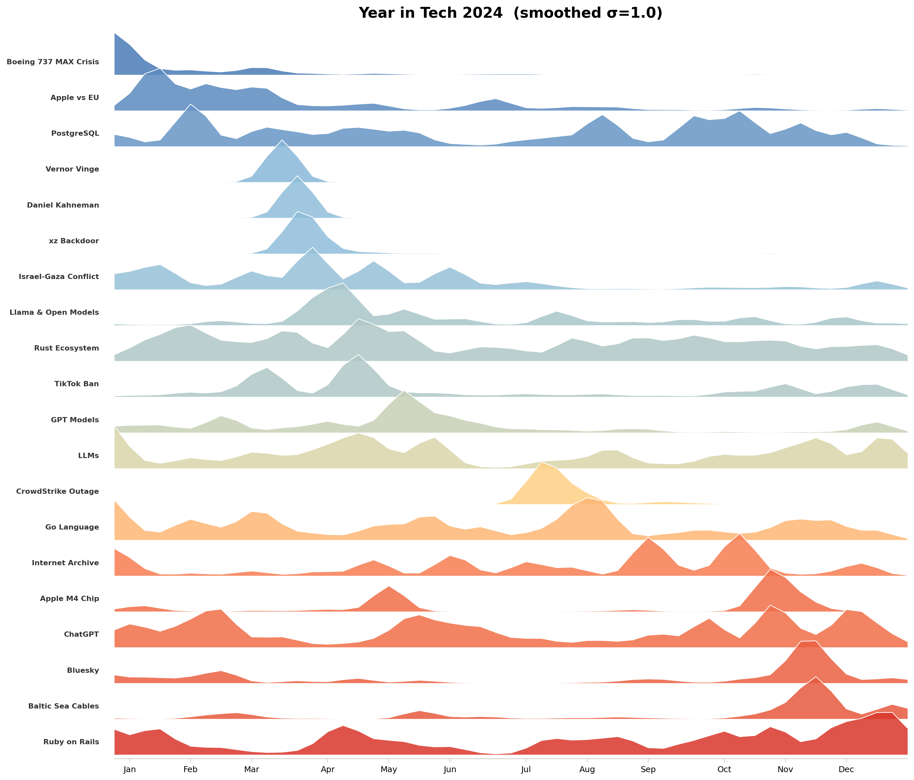

# Year in Tech

A pipeline that discovers what topics captured outsized attention on Hacker News in a given year and visualizes their attention curves as a ridge plot.



## How it works

The pipeline takes a year of Hacker News data and asks: *what were the big stories in tech this year?* It answers by treating HN's collective upvoting and commenting as an editorial signal — the community already surfaces what it finds noteworthy. Our job is to aggregate that signal into coherent topics, measure their intensity over time, and visualize the result.

### 1. Attention scoring

Each HN post gets a combined attention score:

```
attention = score + 0.5 × num_comments
```

This weights both upvotes and discussion. A post with 200 upvotes and 100 comments scores 250. The 0.5 weight is tunable in `src/config.py`.

### 2. Embedding and clustering

Post titles are encoded into 384-dimensional vectors using `all-MiniLM-L6-v2` (a sentence transformer). UMAP reduces these to 50 dimensions, then HDBSCAN groups semantically similar titles into topic clusters. This is unsupervised — no predefined categories, no keyword lists. The algorithm discovers topics from the data.

For 2024, this produces ~3,400 clusters from ~87,000 filtered posts. About 38% of posts end up as "noise" (not belonging to any cluster), which is normal for HDBSCAN and expected — many HN posts are one-off stories.

### 3. Time series and classification

For each cluster, we compute a 53-point weekly attention curve (ISO weeks 1–53) and derive metrics:

| Metric | What it measures |
|--------|-----------------|
| `total_attention` | Overall magnitude across the year |
| `peak_attention` | Height of the tallest week |
| `peak_week` | When the peak occurred |
| `duration_weeks` | Weeks with attention > 20% of peak |
| `spike_ratio` | Peak vs. mean attention (spikiness) |

Topics are classified based on these metrics:
- **Spike** — sharp, short-lived events (spike_ratio > 4, duration ≤ 3 weeks). Example: CrowdStrike outage, xz backdoor.
- **Sustained** — persistent year-round discussion (duration > 8 weeks). Example: Rust ecosystem, ChatGPT, LLMs.
- **Moderate** — everything in between. Example: TikTok ban, Boeing 737 MAX.

### 4. Labeling and curation

Each cluster is auto-labeled with the title of its highest-attention post, cleaned of HN prefixes ("Show HN:", "Ask HN:", etc.). The top 50 topics by total attention are exported as a draft CSV for human review.

Curation is intentionally manual: scan the list, merge topics that overlap, shorten labels, select 15–25 for the final visualization. An AI curation pass can suggest selections, but a human makes the final call.

### 5. Visualization

The final output is a ridge plot where each row is a topic's weekly attention curve, ordered chronologically by peak week. Topics are colored on a cool-to-warm gradient (January = blue, December = red). Gaussian smoothing (σ=1.0) removes weekly jitter while preserving spike character.

## 2024 results

The 2024 ridge plot (shown above) captures 20 topics spanning the year:

- **January**: Boeing 737 MAX door plug blowout, Apple forced to comply with EU DMA
- **March**: Vernor Vinge and Daniel Kahneman deaths, xz backdoor supply chain attack
- **Spring**: TikTok ban legislation, Meta Llama 3 release, GPT-4o launch
- **Summer**: CrowdStrike outage crashes millions of Windows machines worldwide
- **Fall**: Internet Archive loses appeal, Apple M4 launch, ChatGPT Search/Pro, Bluesky surge
- **Year-round**: Rust ecosystem, LLMs, Go language community, PostgreSQL

## Adapting this to other data

The pipeline is source-agnostic in design. To apply it to a different dataset:

1. Replace `src/ingest.py` with a loader for your data source. Output schema: `{id, title, score, num_comments, timestamp, url, attention}` as a parquet file.
2. Adjust `COMMENT_WEIGHT` in `config.py` if your source weights engagement differently.
3. Tune `MIN_CLUSTER_SIZE` and `MIN_SAMPLES` for your data volume — smaller datasets need smaller values.
4. Run the pipeline and curate the results.

The embedding, clustering, scoring, and visualization phases work unchanged on any data that follows the post schema.

## Future directions

- **Multi-year mode** — run the pipeline across multiple years, compute cross-year baselines to filter out perennial topics (Python, React, etc.), and generate comparison ridge plots.
- **LLM labeling** — use an LLM to generate short, clean topic labels from each cluster's top titles instead of using raw HN titles.
- **Multi-source** — add Reddit tech subreddits as a second attention signal, with per-source normalization.
- **Job postings ("Year in Hiring")** — apply the same pipeline to job data using posting count as the attention signal. Facet by seniority and geography for sliceable ridge plots. See DESIGN.md §11b.

## Setup and usage

Requires Python 3.10+ and the [toolkit](https://github.com/your-org/toolkit) sibling project installed as an editable package.

```bash
pip install -r requirements.txt
pip install -e ../toolkit  # sibling project providing embedding and clustering
```

Run each phase sequentially:

```bash
python -m src.ingest --year 2024     # ~2 min (downloads ~200MB)
python -m src.embed --year 2024      # ~5 min (CPU)
python -m src.cluster --year 2024    # ~1 min
python -m src.score --year 2024
python -m src.label --year 2024
python -m src.curate --year 2024     # then edit data/curated/2024_draft_topics.csv
python -m src.visualize --year 2024  # outputs to output/
```

All parameters are in `src/config.py`.
