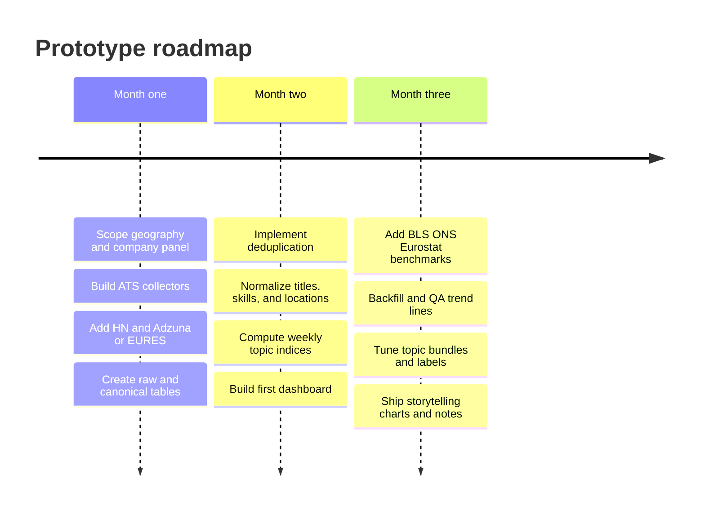

# Job-market data sources for a prototype that tracks attention in tech via job postings

## Executive summary

For a prototype, the strongest starting point is **not** to scrape the biggest consumer job boards first. The highest-leverage stack is usually: **official labor statistics for benchmark baselines**, **ATS-backed company career pages for clean posting-level data**, **one low-friction aggregator with an API**, and **one niche community source for tech-specific signal**. Concretely: use the entity["organization","U.S. Bureau of Labor Statistics","us labor statistics agency"], the entity["organization","Office for National Statistics","uk statistics agency"], and entity["organization","Eurostat","eu statistics office"] for denominators and trend context; use entity["company","Greenhouse","hiring software company"], entity["company","Lever","ats software company"], and entity["company","Ashby","ats software company"] career-page APIs for post-level data; add either entity["company","Adzuna","job search company"] or entity["organization","EURES","eu job mobility portal"] for broader market breadth; and add entity["organization","Hacker News","yc tech forum"] Who’s Hiring threads for startup/engineering signal. That mix is fast to stand up, legally safer than board scraping, and good enough for storytelling charts about “what the market was paying attention to” rather than econometric measurement. citeturn34search6turn33search6turn33search3turn35search0turn40search0turn4search11turn40search14turn36search13turn28search0turn29search5turn28search2turn25search2turn22search0turn23search0

The sources that look most attractive by brand recognition—entity["company","LinkedIn","professional network company"], entity["company","Indeed","job board company"], entity["company","Glassdoor","workplace reviews company"], entity["company","Monster","job board company"]—are generally **bad prototype foundations unless you are an approved posting-side partner**. Their official APIs and docs are oriented toward posting jobs, ATS integration, campaigns, or applications, not open programmatic access to the whole searchable jobs corpus; and LinkedIn’s crawling terms explicitly prohibit automated crawling without permission. Glassdoor still exposes developer pages, but its robots rules heavily restrict crawling and its public API surface looks legacy and gated. citeturn19search0turn19search22turn9view1turn9view2turn8search14turn18search1turn14view0turn14view1turn16view1turn15search1turn16view0

If the prototype proves useful, the most sensible paid upgrade path is usually **Adzuna or Textkernel/Jobfeed first**, then **Lightcast or TalentNeuron** if you need larger geographic coverage, stronger deduplication, richer skills/title normalization, or programmatic enterprise delivery via feeds and warehouses. Public pricing is sparse: Lightcast uses custom subscription/consulting pricing, TalentNeuron does not publish standard pricing, Textkernel/Jobfeed pricing is demo-led, while Adzuna has a public developer API plus public procurement pricing for some intelligence products. citeturn24search0turn24search5turn24search7turn26search16turn25search1turn25search8turn27search4turn27search2

## Public and official sources

Official statistics are most useful here as **benchmark layers**, not as the narrative source itself. In the US, BLS gives you a clean benchmark stack: **JOLTS** for job openings, hires, and separations, with a monthly history back to December 2000; **OEWS** for annual employment and wage estimates across roughly 830 occupations; and a public API for raw programmatic access. BLS material is in the public domain. For a tech-attention prototype, these series are valuable as a reference denominator—“AI engineering postings rose while overall software openings were flat,” for example—but they do not give you posting text, skills strings, or employer-level event spikes. citeturn33search6turn33search3turn33search7turn34search6turn34search0

In the UK, ONS is more directly useful because it combines classic vacancy statistics with online-ad data. Its statistics API is open, unrestricted, and requires no API key. On the macro side, ONS publishes regular Vacancy Survey outputs and labor-market time series. On the posting-like side, ONS now publishes **monthly new online job adverts** sourced from Textkernel; ONS’s methodology notes say the underlying Textkernel collection is built from web-scraped job boards and recruitment pages and includes titles, descriptions, posting dates, and expiration dates. ONS also explicitly cautions that these online-ad estimates are an indicator of changing labor demand, not a one-to-one vacancy count. Reuse is generally under the UK Open Government Licence. citeturn35search0turn35search4turn35search11turn40search0turn40search4turn40search8turn40search16turn34search7turn34search3

Across Europe, Eurostat’s statistics web services are free, REST-based, and deliver data in JSON-stat. For vacancies, the key dataset family is **JVS**: quarterly job vacancies, occupied posts, and vacancy rates, including the long-running dataset from 2001 onward by NACE activity. Eurostat is very strong for cross-country benchmarking and sector-level comparison, but weak for post-level storytelling because its public dissemination layer is aggregate; microdata access is restricted for scientific purposes. citeturn4search11turn4search9turn4search10turn40search2turn40search3turn40search14turn40search18turn4search15

EURES is the closest thing in this group to a live public vacancy source. The portal says its vacancy database is updated daily, contains millions of vacancies, and republishes data transmitted by members and partners across Europe. Portal reuse is authorized with attribution to the European Labour Authority. The practical caveat is access design: the current portal clearly supports public search and dashboards, but in this pass I did **not** find a stable, well-documented modern public developer API for bulk vacancy extraction comparable to Adzuna or Textkernel. For a prototype, EURES is viable as a searchable source and a Europe-first benchmark, but I would not make it the sole ingestion backbone unless you verify extractability early. citeturn5search1turn5search2turn36search13turn36search15turn36search0turn5search3

| Official source | What you actually get | Time range and cadence | Access method | Licensing / reuse | Prototype value |
|---|---|---|---|---|---|
| BLS JOLTS / OEWS | JOLTS: job openings, hires, separations; OEWS: occupation employment and wages | JOLTS monthly since Dec 2000; OEWS annual | Public API, tables, downloads | Public domain | Best US benchmark layer, not a post-text source. citeturn33search6turn33search3turn34search6turn34search0 |
| ONS Vacancy Survey + Textkernel online adverts | Vacancy counts; monthly new online adverts; titles/descriptions/dates in source methodology | Monthly releases; current ONS Textkernel dataset is monthly | Open API, XLSX/CSV, bulletin pages | OGL-style reuse with attribution | Best UK blend of official benchmark and near-posting signal. citeturn35search0turn40search0turn40search4turn34search7 |
| Eurostat JVS | Vacancies, occupied posts, job vacancy rate by activity | Quarterly; dataset from 2001 onward | Free JSON-stat API / databrowser | EU reuse rules; public dissemination | Best EU macro denominator. citeturn4search11turn40search2turn40search14turn40search18 |
| EURES | Live vacancies, occupation/location dashboards, portal statistics | Daily vacancy database updates | Public portal and dashboards; public bulk API unclear | Reuse authorized with attribution | Good Europe-first vacancy signal if extraction is feasible. citeturn5search2turn36search13turn36search0 |

## Job boards and communities

LinkedIn does have an official Job Posting API, but it is for **authorized third parties such as ATS systems and job distributors** posting jobs to LinkedIn on behalf of customers. That is useful if your product is on the employer side; it is not a general-purpose labor-market data feed. Separately, LinkedIn’s crawling terms say automated crawling without express permission is strictly prohibited, its robots file warns that automated access without permission is prohibited, and LinkedIn help explicitly bans third-party software that scrapes or automates activity on the site. For prototype analytics, this puts LinkedIn in the **high-value / high-risk / low-access** bucket. citeturn19search0turn19search3turn19search22turn9view1turn7search1turn7search4

Indeed is similar. Official Indeed docs provide APIs, XML feeds, OAuth, Job Sync, and Indeed Apply integrations; those are clearly real and current. But they are aimed at approved partners, ATS vendors, direct employers, job posting management, and application/disposition flows. Indeed’s terms also regulate use of the site and its APIs, and Indeed’s job-seeker guidance prohibits using third-party bots or automated tools to apply for jobs. In practical prototype terms: if you are the supply side, Indeed is integrable; if you are trying to harvest the public search corpus, official support is much weaker and policy risk rises quickly. citeturn9view2turn8search14turn8search2turn8search10turn8search9turn18search4turn18search1turn18search21

entity["company","ZipRecruiter","job marketplace company"] is the cleanest of the big mainstream boards from an API-documentation perspective, but again mostly on the posting side. Its partner toolkit documents Jobs API, questions, XML feed import, apply webhook, and hiring signals for ATS integrations. That makes it attractive if you already have employer or ATS relationships. It is less attractive if your prototype is independent labor-market intelligence built from the outside. citeturn9view3

Monster’s current public surface is a job search site plus partner/job-feed machinery. The public help center documents job feeds for media alliance partners, and the robots file explicitly disallows many paths while allowing only narrow search endpoints. I did not find a modern public Monster developer jobs-search API in official documentation during this pass. So Monster is workable as a browse/search destination, but as a data backbone it looks partnership-led and somewhat brittle. citeturn15search1turn15search3turn16view0

Glassdoor is unusual. The site still exposes developer pages for jobs and companies APIs, shows registration tied to a Glassdoor account, and explicitly says some additional jobs APIs are only available to API partners. But Glassdoor’s robots file disallows `/api`, `/search`, and many job-view/search patterns, which is a strong hint that even if the legacy API surface still exists, broad crawling or unofficial extraction is likely to be fragile and contentious. Glassdoor is also strategically better for **salary/review context** than for a canonical live-jobs corpus. citeturn14view0turn14view1turn14view2turn16view1

entity["company","Stack Overflow","developer community company"] Jobs and Developer Story were officially sunset in March–April 2022. There is now a newer Stack Overflow Jobs surface, but Meta posts make clear it is effectively an Indeed-backed product and, as of February 2026, only available in the United States. For historical prototyping, old Stack Overflow Jobs is therefore an **archive problem**, not a current API problem. Use it only through preserved historical data, not as a live ingestion dependency. citeturn21view2turn21view3turn21view1

Hacker News is the opposite: niche but prototype-friendly. The official HN Firebase API exposes public data in near real time, Algolia’s HN Search API gives searchable historical access, and the monthly “Who is hiring?” threads are official recurring posts with a stable community format. This is a very good source for startup, infrastructure, and engineering-attention storytelling, with the obvious limitation that it represents a narrow slice of the market. citeturn22search0turn23search0turn23search5turn22search1turn22search11

## Commercial providers and aggregators

entity["company","Lightcast","labor market data company"] is the most full-stack enterprise option in this set. It advertises more than 18 billion labor-market data points, coverage across 165 countries, and delivery via APIs, SFTP/cloud storage, and data warehouses. Its postings API exposes individual postings; its published rate limits are concrete; and its documentation describes a two-step deduplication system that can remove up to 80% of collected duplicate advertisements. It also publishes title and skills taxonomies, including an open titles library and open skills taxonomy. The main drawback for a prototype is cost and procurement friction: pricing is custom rather than self-serve. If budget is available and you want fewer ingestion headaches, Lightcast is the premium path. citeturn39view2turn26search13turn39view0turn39view1turn39view3turn24search0turn38search3turn38search7turn38search11

entity["company","Burning Glass Technologies","labor market data company"] is best understood today as legacy branding: Lightcast explicitly states that Burning Glass Technologies is now Lightcast. So if someone proposes “Burning Glass data,” the current commercial conversation is really a Lightcast conversation. citeturn24search21turn39view2

entity["company","TalentNeuron","workforce intelligence company"] sits a bit differently. Its positioning is strategic workforce planning and DaaS rather than pure vacancy harvesting, but its official pages promise APIs/data feeds, 40 terabytes of normalized data, billions of profiles, tens of thousands of skills, and coverage of 105 countries and markets. TalentNeuron also documents its duplicate logic at a high level, using requisition number, title, location, employer, and date. Pricing does not appear to be publicly posted in a useful way. For a prototype, TalentNeuron is more likely to be overkill unless the target user is already an enterprise HR or workforce-planning stakeholder. citeturn26search4turn24search7turn26search0turn38search1turn26search16

entity["company","Textkernel","hr technology company"] / Jobfeed is a particularly strong middle ground, especially for Europe. Official pages say its labor-market products provide over 3 billion current and historical job postings from more than 33 million websites through APIs or feeds; the API docs publish explicit rate limits; and ONS now uses Textkernel-sourced online-ad data in official statistics. That combination—broad crawling, explicit API docs, and evidence of use by statistical bodies—is unusually favorable. Pricing is not public, but from a prototype-risk perspective Jobfeed is one of the clearest “pay to move faster” options. citeturn25search1turn25search11turn25search3turn25search8turn26search3turn40search0turn40search4

Adzuna is the easiest commercial source to test quickly. Its public developer API supports searches over job ads plus salary/vacancy datasets, requires simple key registration, and its terms explicitly contemplate publishing Adzuna listings and data under conditions. Adzuna’s intelligence pages also say they can provide historical data, full job details, and standardized titles/skills. For enterprise intelligence pricing, public procurement material shows meaningful but nontrivial annual price points, suggesting it can scale from prototype to paid pilot. Compared with Lightcast/Textkernel, Adzuna usually has less enterprise normalization depth, but much lower integration friction. citeturn25search2turn25search4turn25search10turn27search0turn27search4turn27search7turn27search20turn27search23turn27search2

## Alternative and archival sources

Company career pages are the best underused source class for a prototype. Greenhouse’s Job Board API gives raw JSON for published jobs, offices, and departments. Lever distinguishes between a publicly accessible Postings API for published jobs and an authenticated broader API; its docs also mention an XML feed. Ashby’s public job-posting API returns currently published job postings and can include compensation. These feeds are high signal because they are close to the employer’s source of truth, typically quicker to refresh than board copies, and often easier to use within terms than scraping giant boards. Their main weakness is coverage: you must deliberately choose employers or ATS footprints to watch. citeturn28search0turn28search8turn29search5turn29search13turn29search2turn28search2turn28search14

For “Google Jobs API,” the important distinction is this: Google officially supports **JobPosting structured data** so publishers can be surfaced in Google Search, and Google Cloud Talent Solution provides APIs to create/search jobs inside your own integrated corpus. What I did **not** find in the current official docs is a public API for pulling Google-for-Jobs search-result data as an open market dataset. For a prototype, that means Google should be treated as a **distribution channel** or **publisher integration target**, not a source of record for harvesting. citeturn31search0turn31search3turn31search1turn31search4turn31search7turn31search23

entity["company","Kaggle","data science platform company"] is useful for bootstrapping experiments, schema prototyping, classifier tests, and demo notebooks, but not as a trustworthy production source. Kaggle’s own materials emphasize that dataset licenses vary, and the platform contains both synthetic job datasets and scraped board-derived datasets with heterogeneous provenance and licensing. Use Kaggle to accelerate experimentation; do not treat it as your main ongoing feed unless you have validated source legality and refresh process dataset by dataset. citeturn32search5turn32search1turn32search13turn32search8turn32search16

Academic datasets exist and can be genuinely useful, but they are almost always **niche, static, and purpose-built**. Examples from this pass include a 2026 paper on weekly K–12 and higher-education job-post tracking and the recent VietJobs corpus for Vietnamese job ads. These are excellent for methods benchmarking and NLP experiments, but poor substitutes for a live, longitudinal tech-attention pipeline. citeturn32search6turn30academia20

## Practical ingestion strategy for a prototype

A practical prototype should use **three lanes of data**, each serving a different function. First, ingest **clean employer-adjacent feeds** from ATS-backed career pages for a deliberately chosen panel of tech companies, large cloud vendors, AI startups, and infrastructure firms. Second, ingest **one breadth source**—Adzuna if you want quick API breadth, or EURES if Europe is primary. Third, ingest **one community signal source**, namely Hacker News Who’s Hiring. That combination is more robust than starting with one giant source because it lets you compare source-specific stories against each other and against official baselines.

Deduplication should be explicit from day one. The safest prototype pattern is a **two-stage dedupe**: exact dedupe on `(source, source_job_id)` when stable identifiers exist; then fuzzy dedupe on normalized employer, canonical title, canonical location, and first-seen window. Lightcast says it uses normalized title/company/location across a 60-day window, while TalentNeuron says it compares requisition number, title, location, employer, and date. A prototype does not need their full sophistication, but it should follow the same logic. Do **not** chart raw row counts from multi-source ingestion. citeturn39view3turn38search1

Canonicalization is the other non-negotiable piece. Normalize job titles against a stable occupation/title vocabulary; normalize skills against an external skills taxonomy; normalize locations early. The most practical public standards here are O*NET for US occupation descriptors and ESCO for multilingual European skills/occupations. If budget is available, Lightcast’s open titles and skills libraries are a useful bridge because they are explicitly designed to connect messy titles/skills to labor-market analytics. citeturn37search15turn37search13turn37search19turn37search1turn37search6turn37search14turn38search7turn38search11

The minimum useful refresh cadence is **daily pulls for live sources**, **weekly canonicalization/aggregation**, and **monthly benchmark refreshes** for official stats. If the goal is attention charts rather than a search engine, store every retrieved version but compute charts over **weekly unique-posting counts**, **weekly employer counts**, **share of postings mentioning topic-skill bundles**, and **source-mix diagnostics**. That gives you pytrends-like lines with enough stability for storytelling.

A minimal storage design can stay very small:

```text
source_pull(
  source_name, pull_ts, status, request_params, row_count, checksum
)

raw_posting(
  raw_id, source_name, source_job_id, source_url, fetched_ts,
  title_raw, company_raw, location_raw, body_raw, salary_raw,
  posted_at_raw, closes_at_raw, employment_type_raw
)

canonical_posting(
  posting_uid, raw_id, employer_id, employer_name_canon,
  title_id, title_canon, occupation_code, location_id, country_code,
  posted_date, first_seen_date, last_seen_date, is_unique, dedupe_cluster_id
)

posting_skill(
  posting_uid, skill_id, skill_name_canon, evidence_span, confidence
)

trend_metric_weekly(
  week_start, topic_id, geo, unique_postings, employer_count,
  skill_mentions, source_mix_json, indexed_value
)
```

For the charting layer, a simple and defensible “jobs attention” metric is: **weekly unique postings matching a topic bundle / total weekly unique tech postings in the same source panel**, then optionally indexed to 100 within the chosen time window. That keeps the storytelling style you described while avoiding complete dependence on raw source volume.

## Legal, ethical, and bias considerations

The biggest legal distinction is between **official access** and **unauthorized extraction**. Official statistics, ATS job-board APIs, and documented partner feeds are the low-risk end. Public-web scraping of major boards is the high-risk end, especially where terms or robots files are explicit. LinkedIn is the clearest case: it prohibits automated crawling without permission. Glassdoor disallows core API and search paths in robots. Indeed’s official posture centers on approved partner APIs and regulated use of the site. For a prototype, the easiest risk reduction is simple: stay on public postings, prefer documented APIs, avoid login walls, and do not ingest applications, CVs, recruiter messages, or personal profiles. citeturn9view1turn16view1turn9view2turn18search4turn9view0turn36search5

Representativeness bias is unavoidable. A long-standing Georgetown analysis of online job ads estimated that 60% to 70% of openings were posted online even then, while also emphasizing bias toward high-skill, white-collar occupations. That bias is especially relevant here because your target is “attention in tech”: online job data may actually be directionally appropriate for tech, but it will still overrepresent firms, regions, and occupations that recruit online heavily. HN Who’s Hiring is even more selective: valuable for startup engineering trends, poor for the broader labor market. citeturn32search2turn22search1turn22search11

Duplicates and “vacancies” are not the same thing. ONS explicitly notes that online adverts can contain multiple openings or rolling campaigns and therefore do not map one-to-one to vacancies. That is why deduplication and source labeling matter so much: a reposting burst, a board syndication wave, or an ATS migration can look like labor-market attention if you chart rows instead of unique postings. citeturn40search16turn39view3turn38search1

Privacy and data-protection exposure rises sharply once you move beyond public job ads into candidate data. For a prototype, there is almost never a good reason to store applicant payloads, user accounts, or discussion identities. Keep only employer-facing public posting data, remove incidental personal data if it appears in descriptions, and publish only aggregate trend outputs.

## Recommended approach and roadmap

The best prototype stack, given unspecified geography and time horizon, is:

1. **ATS/company feeds first**: Greenhouse, Lever, and Ashby job feeds for a curated panel of tech employers.  
2. **One breadth source**: Adzuna if you want the fastest self-serve API path; EURES if Europe is the initial scope.  
3. **One community source**: Hacker News Who’s Hiring for startup and engineering zeitgeist.  
4. **Official baselines**: BLS, ONS, and/or Eurostat for normalization context and denominator charts.  
5. **Only later**: A commercial layer such as Jobfeed or Lightcast if the manual source work starts dominating engineering time. citeturn28search0turn29search5turn28search2turn25search2turn36search13turn22search0turn23search0turn34search6turn35search0turn40search14turn25search1turn39view2

That recommendation is mainly a tradeoff between **access friction** and **signal quality**. ATS feeds and HN are lower-risk and semantically rich. Adzuna is the quickest bridge to market breadth. Official stats keep the charts grounded. The large consumer boards are deliberately not in the starter set because their official APIs are mostly posting-side and their extraction risk is disproportionate to the value of a prototype. citeturn19search0turn9view1turn9view2turn14view0turn16view1

### Comparison table

| Source | Access method | Cost | Freshness | Coverage | Fields typically obtainable | Legal / policy risk | Recommended use-case | Evidence |
|---|---|---|---|---|---|---|---|---|
| ATS career pages via Greenhouse / Lever / Ashby | Official public job APIs / postings APIs | Usually free to read public jobs | Near real time | Employers using those ATSs | Title, team, location, description, apply URL, sometimes compensation | Low to moderate | Best prototype core corpus | citeturn28search0turn29search5turn28search2 |
| Adzuna | Public API + enterprise intelligence | Low friction to start; enterprise pricing varies | Live search + historical/intelligence options | Broad aggregator coverage | Ads, salary/vacancy data, historical series, standardized titles/skills in intelligence offering | Low to moderate | Best quick breadth source | citeturn25search2turn25search10turn27search4turn27search2 |
| EURES | Public portal and dashboards | Free | Daily database updates | Europe | Vacancy counts, occupation/location breakdowns, portal stats | Low | Europe-first public vacancy source | citeturn5search2turn36search13turn36search0 |
| Hacker News Who’s Hiring | Official HN API + Algolia HN Search API | Free | Monthly thread cadence; API is live/searchable | Startup and tech community | Company blurbs, hiring tags, role descriptions in comments | Low | Tech zeitgeist / startup signal | citeturn22search0turn23search0turn22search1 |
| BLS / ONS / Eurostat official stats | Official APIs / downloads | Free | Monthly or quarterly | US / UK / EU official aggregates | Openings, vacancies, rates, wages, employment | Low | Benchmarking and denominator layers | citeturn34search6turn35search0turn40search14 |
| LinkedIn / Indeed / Monster / Glassdoor | Mostly partner-side APIs; public-site extraction otherwise | Often partner/commercial or unofficial scraping cost | High if accessible | Large platforms | Rich postings, but access is constrained | High | Avoid as prototype backbone unless you are a partner | citeturn19search0turn9view1turn9view2turn14view0turn16view1turn16view0 |
| Textkernel / Jobfeed | Commercial API and feeds | Commercial, not public list price | Daily / real time | Very broad; especially strong in Europe | Current and historical postings, classification/enrichment | Low to moderate | Best first paid upgrade for labor-market intelligence | citeturn25search1turn25search8turn26search3turn40search0 |
| Lightcast | Commercial API / SFTP / warehouse | Custom enterprise pricing | Real time / scheduled delivery | Global, 165 countries | Postings, skills, titles, company data, compensation | Low | Full enterprise upgrade path | citeturn39view2turn39view0turn39view1turn24search0 |

A realistic three-month roadmap for one technical owner plus part-time product/analysis support is roughly **7 to 11 person-weeks** total:

- **Month one**: choose geography, company panel, and topic ontology; build ATS/HN/Adzuna or EURES collectors; stand up storage; start daily pulls. Estimated effort: **2 to 3 person-weeks**.
- **Month two**: implement dedupe, title/skill/location canonicalization, trend aggregation, and a first chart dashboard. Estimated effort: **2 to 4 person-weeks**.
- **Month three**: QA historical consistency, tune topic buckets, add benchmark overlays from official stats, and produce a publication-ready chart set. Estimated effort: **3 to 4 person-weeks**.



**Open questions / limitations**

- **Geography is unspecified.** The recommended starter stack is biased toward English-language US/UK/EU sources.  
- **Historical depth requirement is unspecified.** If you need many years of backfill, commercial providers become much more attractive.  
- **GitHub Jobs archival coverage was not re-verified in official current docs during this pass.** Treat any GitHub Jobs data as archival/secondary rather than core.  
- **If compensation analysis is central rather than optional, source selection changes** because salary field coverage differs sharply across boards, ATSs, and jurisdictions.